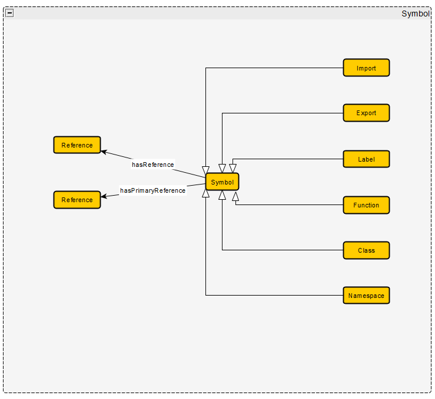
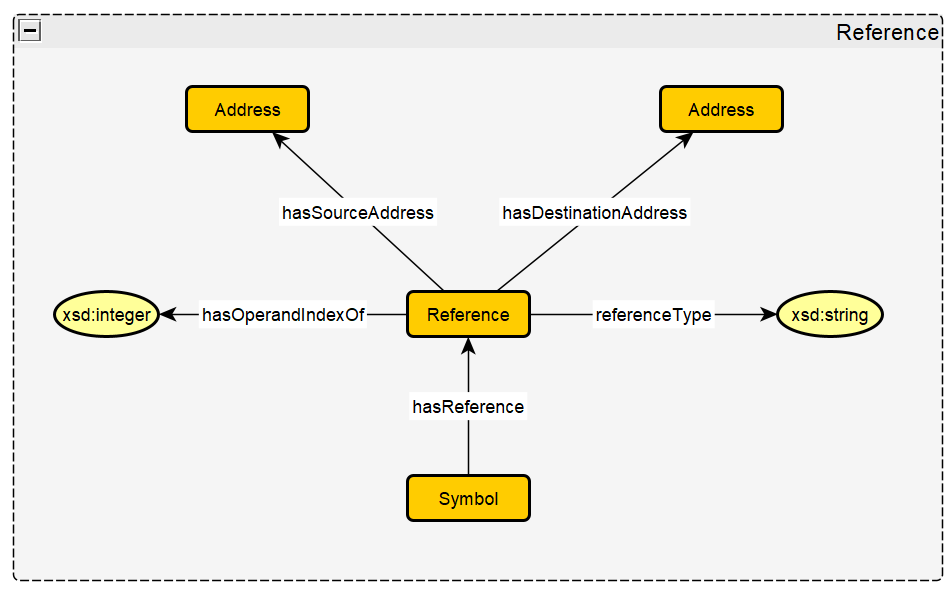
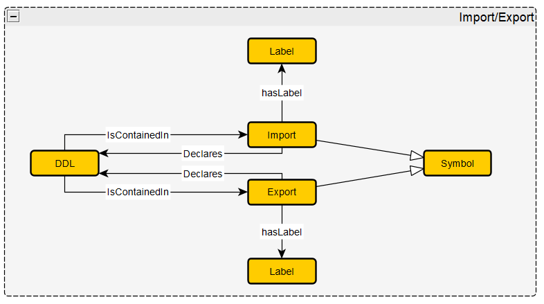
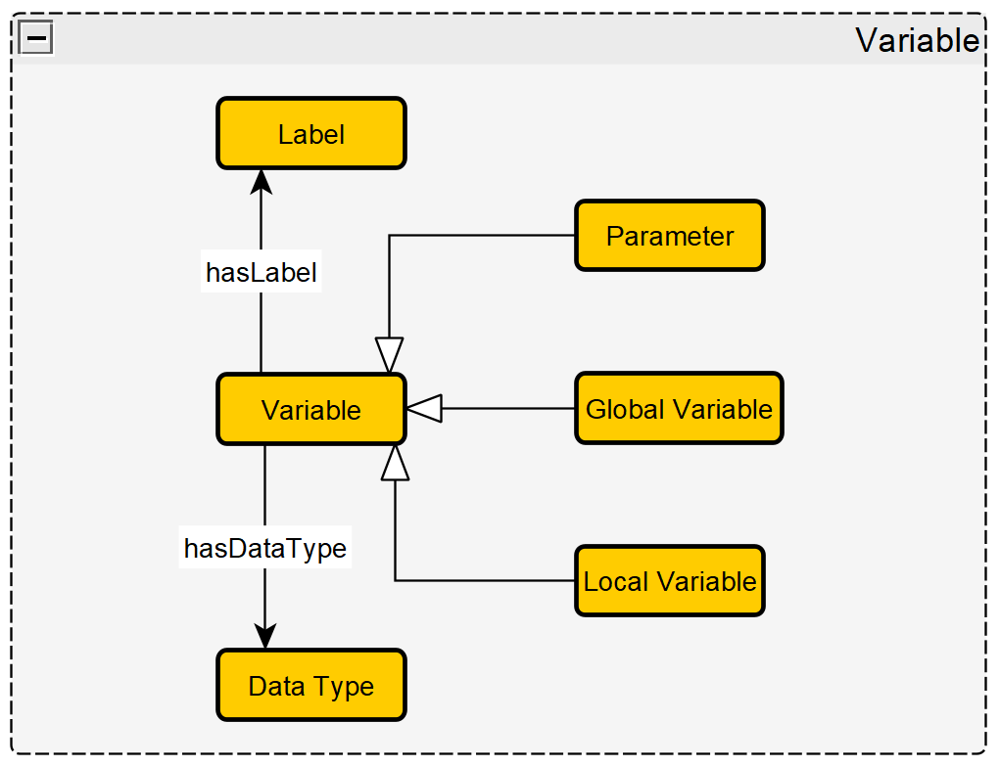
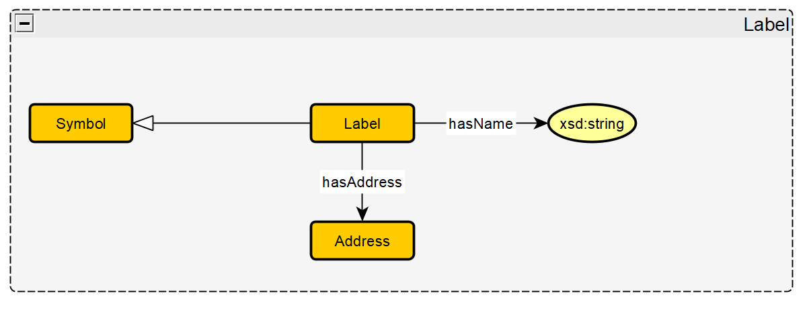
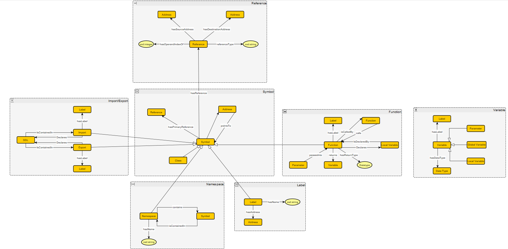

<!-- 
Identify a thorough list of key notions.

    For each key notion, explain the rationale of why it is a key notion.
    For each key notion or set of key notions, identify a pattern which can be used to model them, otherwise indicate that there is no existing pattern.
        Draft an instantiation of the pattern (a module) based on the use-case, where possible.
        For key notions with no pattern, draft a module which would model them.
    Connect the key notion to where the data is coming from. For example, if an Event is a key notion, which piece of the identified datasets are used to populate the module.
        Occasionally there will be controlled vocabularies. These are not technically patterns, but are a list of individuals that are important (and will not change). Indicate which key notions behave as such and their list of individuals.
-->

# Key Notions (Modules)

<!--
* Key Notion
    * Rationale: rationale
    * Connected Pattern: pattern name (pattern source)
    * Source Dataset(s): dataset n, dataset n+1
* Key Notion
    * Rationale: rationale
    * Connected Pattern: pattern name (pattern source)
    * Source Dataset(s): dataset n, dataset n+1
* Key Notion
    * Rationale: rationale
    * Connected Pattern: pattern name (pattern source)
    * Source Dataset(s): dataset n, dataset n+1

-->
## Symbol
### Description
A symbol is a named entity in an executable file that is associated with a specific memory address. A symbol can have one or more references, but only one reference is designated as the primary.

### Axioms
* `Symbol hasReference min 0 Reference`  
"A symbol has 0 or more references"
* `Symbol hasPrimaryReference min 0 max 1 Reference`  
"A symbol has up to one primary reference"
* `Symbol superClassOf Class`  
"A class is a type of symbol"
* `Symbol superClassOf Function`  
"A function is a type of symbol"
* `Symbol superClassOf Namespace`  
"A namespace is a type of symbol"
* `Symbol superClassOf Label`  
"A label is a type of symbol"
* `Symbol superClassOf Import`  
"An import is a type of symbol"
* `Symbol superClassOf Export`  
"An export is a type of symbol"

## Reference
### Description
A reference is where two memory addresses interact in some way with each other, where one address uses another. This is used for things like when a function calls another function or when data is accessed by an instrution. References are 4-tuples, which include the source address, destination address, the type of reference (function call, data being accessed, etc.), and the operand index (which is an int that is either -1, 0, or 1).

### Axioms
* `Reference hasSourceAddress address exactly 1 sourceAddress`  
"A reference has exactly one source address"
* `Reference hasDestinationAddress address exactly 1 destinationAddress`  
"A reference has exactly one destination address"
* `Reference hasType xsd:string exactly 1 type`  
"A reference has exactly one reference type indicated by a string"
* `Reference hasOperandIndex xsd:integer exactly 1 index`  
"A reference has exactly one operand index indicated by an integer"

## Import/Export
### Description
Imports allow files to use outside functions within the current file through dynamic link libraries (DLLs). Exports allow other files to use the functions from the current file through DLLs. The imports and edxports are important to look at to see if anything imported or exported is either vulnerable or is similar to other malware behavior, as they can direclty affect the safety of the other files in the supplu chain.

### Axioms
* `Import subClassOf Symbol`  
"Every import is a symbol"
* `Export subClassOf Symbol`  
"Every export is a symbol"
* `Import declares min 1 DLL`  
"Every import declares at least one DLL"
* `Export declares min 0 DLL`  
"Every export declares 0 or more DLLs"
* `Import hasLabel Label exactly 1 label`  
"Every import has exactly one label"
* `Export hasLabel Label exactly 1 label`  
"Every export has exactly one label"

## Function
### Description
Keeps track of all the aspects of a function, including the variables passed in (parameters), the local variables defined in the function, the return type of the function, the return variable of the function, and the label that the function has.

### Axioms
* `Function subClassOf Symbol`  
"Every function is a symbol"
* `Function hasLabel Label exactly 1 label`  
"Every function has exactly one label"
* `Function hasReturnType DataType exactly 1 datatype`  
"Every function has exactly one return type"
* `Function returns min 0 max 1 Variable`  
"Every function returns either no variables or one variable"
* `Function declares min 0 localVariables`  
"A function can declare 0 or more local variables"
* `Function passIn min 0 parameters`  
"A function can pass in 0 or more parameters"
* `Function calls min 0 Function`  
"A function can call 0 or more other functions"
* `Function calledBy min 0 Function`  
"A function can be called by 0 or more other functions"

## Variable
### Description
Keeps track of all the informtion about a variable, including what kind of variable it is (parameter vs local variable vs global variable), what label it has, and its data type.

### Axioms
* `Parameter subClassOf Variable`  
"Every parameter is a variable"
* `GlobalVariale subClassOf Variable`  
"Every GlobalVariable is a variable"
* `LocalVariable subClassOf Variable`  
"Every LocalVariable is a variable"
* `Variable hasLabel Label exactly 1 label`  
"Every variable has exactly one label"
* `Variable hasDataType DataType exactly 1 datatype`  
"Every variable has exactly one data type"

## Label
### Description
Contains a human readable label for a symbol (function, variable, etc.). Contains the string of the name of the label and the memory address the label points to.

### Axioms
* `Label subClassOf Symbol`  
"Every label is a symbol"
* `Label hasName xsd:string exactly 1 name`  
"Every label has exactly one name indicated as xsd:string"
* `Label hasAddress Address exactly 1 address`  
"Every label has exactly one memory address"

## Namespace
### Description
Namespaces group together symbols like functions and classes to make sure there is no naming conflicts within the same scope. Namespaces can hold functions, variables, classes, and other namespaces. Namespaces cannot share names, and classes cannot share names with namespaces.

### Axioms
* `Namespace subClassOf Symbol`  
"Every namespace is a symbol"
* `Namespace contains min 0 Symbol`  
"Every name space contains at least 0 or more symbols"
* `Namespace hasName xsd:string exactly 1 name`  
"Every namespace has exactly one name indicated by xsd:string"

## Overall Schema Diagram
